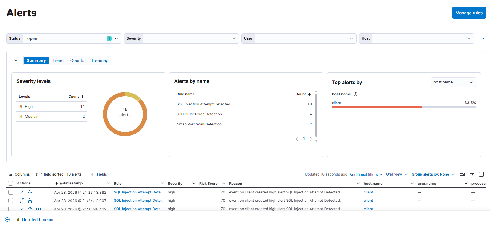
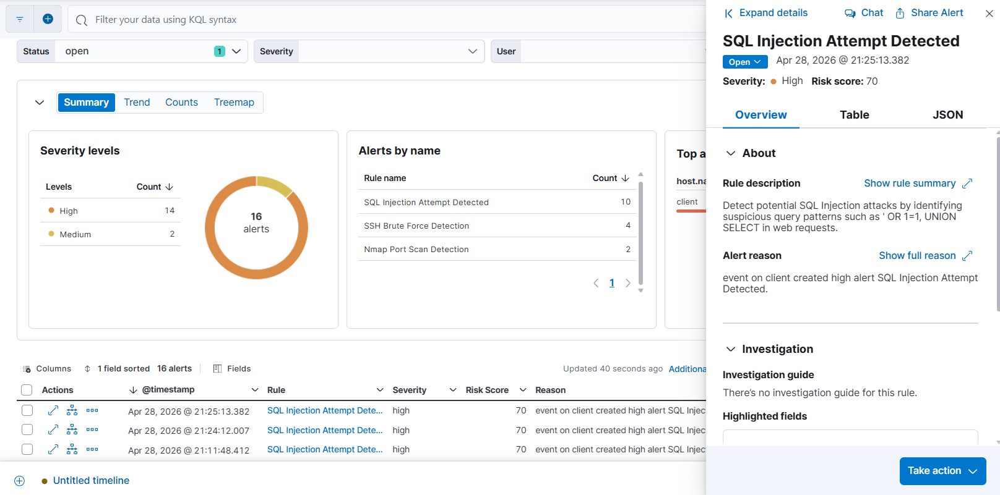

\# 🔥 Attack 03: SQL Injection (DVWA)


\## 📌 Mô tả


SQL Injection (SQLi) là kỹ thuật tấn công cho phép attacker chèn câu lệnh SQL độc hại vào input của ứng dụng web, từ đó truy xuất hoặc thao túng dữ liệu trong database.


Trong bài lab này, DVWA (Damn Vulnerable Web Application) được sử dụng để mô phỏng lỗ hổng SQL Injection.


\---


\## 🎯 Mục tiêu


\* Thực hiện tấn công SQL Injection trên DVWA

\* Quan sát log sinh ra trên máy victim (Apache)

\* Gửi log về Elastic Stack (Filebeat)

\* Tạo detection rule trên Kibana để phát hiện SQLi


\---


\## 🧱 Môi trường


\* Attacker: Kali Linux

\* Victim: Ubuntu + Apache + DVWA

\* SIEM: Elastic Stack (Elasticsearch + Kibana)

\* Log shipper: Filebeat


\---


\## 🚨 Detection Rule


\### Rule type:


Custom Query


\### Index:


```text

filebeat-\\\*

```


\### Query:


```kql

message: ("UNION" AND "SELECT") 

OR message: "information\\\_schema"

OR message: "load\\\_file"

```


\### Schedule:


\* Runs every: 1 minute

\* Look back: 5 minutes


\---


!\[Rule](./screenshots/07-rule_sqli.png)


\## ⚙️ Bước 1: Truy cập DVWA


```bash

http://10.10.1.129/DVWA

```


\* Login DVWA

\* Set Security Level: `low`

\* Truy cập:


```

DVWA → Vulnerabilities → SQL Injection

```


!\[DVWA](./screenshots/01-dvwa.png)


\---


\## 💣 Bước 2: Thực hiện SQL Injection


\### Payload 1:


```bash

1' UNION SELECT user,password FROM users#

```


!\[Payload1](./screenshots/02-payload1.png)


\### Payload 2:


```bash

1' UNION SELECT table\_name,2 FROM information\_schema.tables#

```


!\[Payload2](./screenshots/03-payload2.png)


\### Payload 3:


```bash

1' UNION SELECT load\_file('/etc/passwd'),2#

```


!\[Payload3](./screenshots/04-payload3.png)


\---


\## 📜 Log sinh ra trên victim


```text

10.10.1.130 - - \[time] "GET /DVWA/vulnerabilities/sqli/?id=1' UNION SELECT user,password FROM users# HTTP/1.1"

```


!\[Log](./screenshots/05-log_victim.png)


\---


\## 📡 Bước 3: Gửi log về Elastic


Filebeat đọc log từ:


```bash

/var/log/apache2/access.log

```


\---


\## 🔍 Bước 4: Kiểm tra log trên Kibana


Query:


```kql

message: "UNION"

```


!\[Log1](./screenshots/06-log_kibana.png)


\---


\## 📊 Kết quả


\* Alert được sinh ra trên Kibana khi thực hiện SQL Injection





\---


\## 🧠 Nhận xét


\* Log Apache chứa đầy đủ thông tin request → rất phù hợp cho detection

\* Nếu không parse chuẩn (ECS), có thể dùng `message` để detect

\* SQL Injection dễ detect qua keyword (UNION, SELECT, etc.)


\---


\## ⚠️ Hạn chế


\* Detection dựa vào keyword → dễ bypass

\* Không có context (URL parsed, user, session...)


\---


\## 🚀 Hướng cải tiến


\* Sử dụng Apache integration chuẩn

\* Parse log thành ECS fields (url, source.ip…)

\* Áp dụng ML hoặc anomaly detection


\---


\## 🏁 Kết luận


SQL Injection là một trong những lỗ hổng phổ biến nhất và có thể được phát hiện hiệu quả thông qua việc phân tích log truy cập web.


