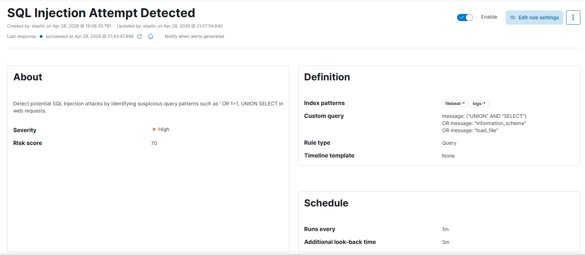
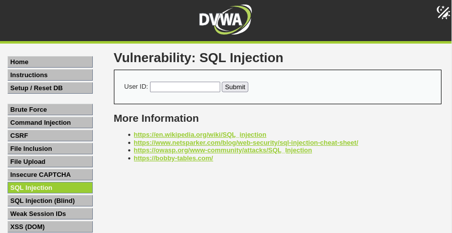
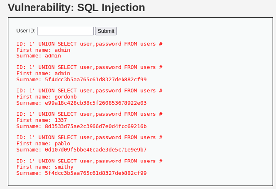
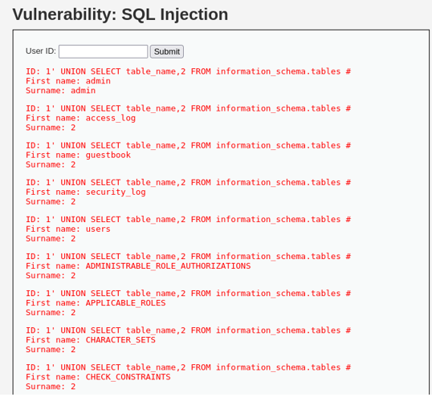
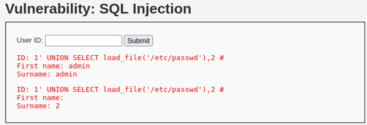
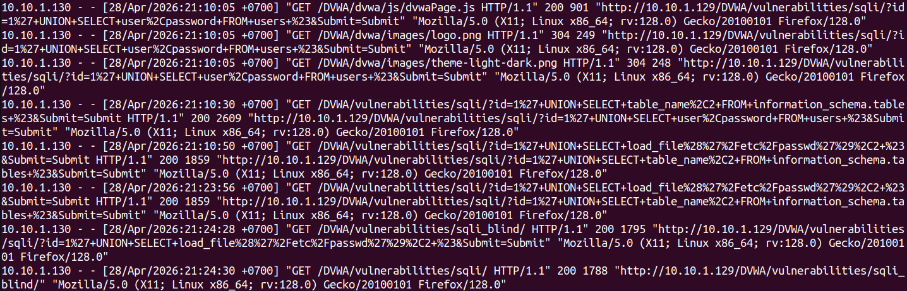
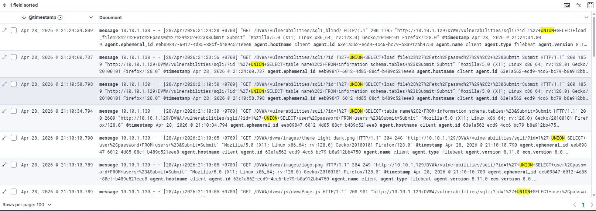

# 🔥 Attack 03: SQL Injection (DVWA)

## 📌 Description

* SQL Injection (SQLi) is an attack technique that allows an attacker to inject malicious SQL statements into a web application's input fields, enabling unauthorized access or manipulation of the database.

* In this lab, **DVWA (Damn Vulnerable Web Application)** is used to simulate a SQL Injection vulnerability.

---

## 🎯 Objectives

* Perform a SQL Injection attack on DVWA

* Observe generated logs on the victim machine (Apache)

* Send logs to Elastic Stack (via Filebeat)

* Create a detection rule in Kibana to detect SQLi

---

## 🧱 Environment

* Attacker: Kali Linux

* Victim: Ubuntu + Apache + DVWA

* SIEM: Elastic Stack (Elasticsearch + Kibana)

* Log shipper: Filebeat

---


## 🚨 Detection Rule

### Rule type:

Custom Query

### Index:

```
filebeat-*
```

### Query:

```
message: ("UNION" AND "SELECT") 
OR message: "information_schema"
OR message: "load_file"
```

### Schedule:

* Runs every: 1 minute
* Look back: 5 minutes

</br>



---


## ⚙️ Step 1: Access DVWA

http://10.10.1.129/DVWA

* Log in to DVWA
* Set Security Level: **low**
* Navigate to:

```
DVWA → Vulnerabilities → SQL Injection
```



---

## 💣 Step 2: Perform SQL Injection

### Payload 1:

```
1' UNION SELECT user,password FROM users#
```



### Payload 2:

```
1' UNION SELECT table_name,2 FROM information_schema.tables#
```



### Payload 3:

```
1' UNION SELECT load_file('/etc/passwd'),2#
```



---

## 📜 Logs on Victim



---

## 📡 Step 3: Send Logs to Elastic

Filebeat reads logs from:

```
/var/log/apache2/access.log
```

---

## 🔍 Step 4: Verify Logs in Kibana

### Query:

```
message: "UNION"
```



---

## 📊 Results

* Alerts are generated in Kibana when SQL Injection is performed


</br>


---

## 🧠 Analysis

* Apache logs contain full HTTP request data → highly suitable for detection

* If logs are not properly parsed (ECS), detection can rely on the `message` field

* SQL Injection is relatively easy to detect using keywords (UNION, SELECT, etc.)

---

## ⚠️ Limitations

* Keyword-based detection can be bypassed

* Lack of context (parsed URL, user, session, etc.)

---

## 🚀 Improvements

* Use official Apache integration

* Parse logs into ECS fields (url, source.ip, etc.)

* Apply machine learning or anomaly detection

---

## 🏁 Conclusion

SQL Injection is one of the most common web vulnerabilities and can be effectively detected through web access log analysis.


